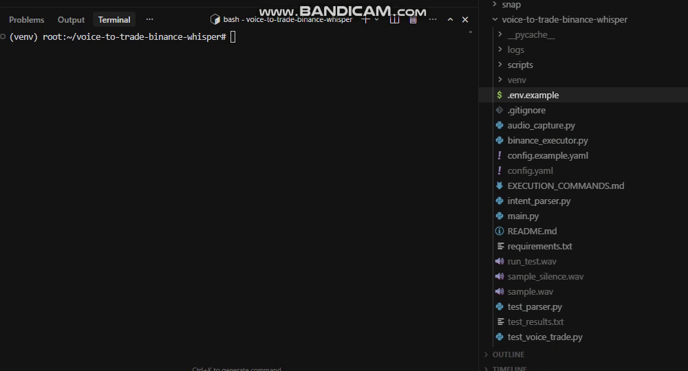

<div align="center">

# Voice to Trade Binance Whisper

## Voice trading bot for Binance using Whisper, Python, and natural language order execution

This project uses **Whisper speech recognition**, **Python**, and the **Binance API** to execute crypto trades from natural language commands.

</div>


---

## What This Project Does

Voice to Trade Binance Whisper is a **voice trading bot for Binance** that lets you place crypto trades using spoken commands.

Instead of manually clicking through exchange interfaces, you can say commands like:

- buy 0.5 BTC at market
- sell 1 ETH at limit 3500
- close my BTC position

The system converts speech to text with **Whisper**, parses the trading intent, and sends the order to **Binance** through the API.

This project is built for:

- Binance traders who want faster execution
- developers building voice-controlled trading tools
- traders testing hands-free crypto workflows
- users who want local speech-to-trade support with optional offline transcription

---

## 🧠 How Voice-to-Trade Works

Most traders lose 2–4 seconds per entry clicking through interfaces. At 20 trades a day, that's compounding latency you never get back.

This utility closes that gap with a three-stage pipeline:
```
╔══════════════════╗     ╔═══════════════════════╗     ╔══════════════════════╗
║  MICROPHONE INPUT ║────▶║  WHISPER STT ENGINE    ║────▶║  INTENT PARSER       ║
║                  ║     ║  (local or API mode)   ║     ║  side / symbol /     ║
║  "Buy 0.5 BTC    ║     ║                        ║     ║  size / order type   ║
║   at Market"     ║     ║  ~300ms transcription  ║     ║                      ║
╚══════════════════╝     ╚═══════════════════════╝     ╚══════════╦═══════════╝
                                                                   │
                                          ╔════════════════════════▼═══════════╗
                                          ║  BINANCE API EXECUTOR              ║
                                          ║  POST /api/v3/order                ║
                                          ║  → confirmed fill in <800ms total  ║
                                          ╚════════════════════════════════════╝
```

**You speak. The order is placed.** The parser handles natural phrasing — "buy half a bitcoin market", "short 200 USDT ETH limit 3200", "close my BTC position" — without rigid command syntax.

---

## 📡 Live Execution Output

Here's a screen capture of the voice-to-trade pipeline in action:


Real session log from paper trading mode:
```
═══════════════════════════════════════════════════════════
  VOICE-TO-TRADE  |  Session Start: 2026-03-11 08:42:03 UTC
═══════════════════════════════════════════════════════════

[08:42:11 UTC] 🎙  Audio captured (1.2s)
[08:42:11 UTC] ✍  Whisper transcript: "buy point five btc at market"
[08:42:11 UTC] 🔍  Parsed intent:
                    symbol  → BTCUSDT
                    side    → BUY
                    type    → MARKET
                    qty     → 0.5 BTC
[08:42:11 UTC] ⚡  Sending order to Binance...
[08:42:12 UTC] ✅  FILLED — orderId: 18472910384
                    avgPrice: 68,412.30 USDT
                    qty: 0.5 BTC
                    latency: 741ms (mic → fill confirmation)

───────────────────────────────────────────────────────────

[08:44:55 UTC] 🎙  Audio captured (1.8s)
[08:44:55 UTC] ✍  Whisper transcript: "limit sell 0.5 btc at 69500"
[08:44:56 UTC] 🔍  Parsed intent:
                    symbol  → BTCUSDT
                    side    → SELL
                    type    → LIMIT
                    qty     → 0.5 BTC
                    price   → 69,500.00
[08:44:56 UTC] ✅  ACCEPTED — orderId: 18473021100
                    status: OPEN (GTC)
                    latency: 612ms

═══════════════════════════════════════════════════════════
  End of snippet  |  2 orders  |  0 parse errors
═══════════════════════════════════════════════════════════
```

Sub-800ms from voice to confirmed fill. No clicks. No keyboard.

---

## ⚡ Key Features of the Binance Whisper Voice Trading Engine

- **Natural language command parsing** — no rigid syntax to memorize; handles fractional quantities, ticker aliases, and order type variations
- **Whisper local mode** — run the STT engine fully offline; your voice audio never leaves your machine
- **Paper trading mode** — dry-run every command against live Binance prices with zero capital risk
- **Real-time audio feedback** — spoken confirmation of parsed intent before execution (optional, configurable)
- **Hot-reload config** — swap API keys, trading pairs, and risk limits without restarting the session
- **Execution log** — timestamped JSON log of every transcript, parsed intent, and API response for audit trails

---

## 🆚 How This Compares to Other Binance Trading Tools

| Tool / Approach | Voice Input | Natural Language | Local STT | Paper Mode | Latency (approx.) | Cost |
|---|---|---|---|---|---|---|
| **voice-to-trade-binance-whisper** | ✅ | ✅ | ✅ Optional | ✅ | ~700ms | Free / open |
| Binance Web UI (manual) | ❌ | ❌ | — | ❌ | 3–6s (human) | Free |
| TradingView Alerts → Webhook | ❌ | ❌ | — | ⚠️ Limited | 1–3s | $15–60/mo |
| 3Commas / Pionex bots | ❌ | ❌ | — | ✅ | 1–4s | $29+/mo |
| Custom keyword-command scripts | ⚠️ Rigid | ❌ | ✅ | Varies | Varies | DIY time |
| Cloud STT + Binance webhook | ✅ | ⚠️ | ❌ | ❌ | 1.5–3s+ | $0.006/15s |

**The gap:** Every existing voice-adjacent solution either requires rigid command syntax, routes your audio through a cloud provider, or doesn't connect to execution at all. This project is the only open pipeline that goes from natural speech → Binance fill with a local model option.

---

## 🏗️ System Architecture for Voice-to-Trade Binance
```
╔══════════════════════════════════════════════════════════════╗
║                    RUNTIME ARCHITECTURE                      ║
╠════════════════════╦═════════════════════╦═══════════════════╣
║  AUDIO LAYER       ║  PROCESSING LAYER   ║  EXECUTION LAYER  ║
║                    ║                     ║                   ║
║  PyAudio stream    ║  Whisper (local)     ║  python-binance   ║
║  VAD trigger       ║    OR               ║  REST API v3      ║
║  WAV buffer        ║  Whisper API        ║  HMAC-SHA256 sig  ║
║                    ║                     ║                   ║
║  ─────────────     ║  Intent Parser      ║  Order validator  ║
║  mic → .wav        ║  regex + NLP rules  ║  risk gate check  ║
║  silence detect    ║  symbol resolver    ║  paper/live mode  ║
╚════════════════════╩═════════════════════╩═══════════════════╝
         │                    │                      │
         └────────────────────┴──────────────────────┘
                          JSON audit log
```

**Data privacy note:** In local Whisper mode, audio is transcribed entirely on-device. Nothing is sent to OpenAI. Your trading commands, portfolio activity, and voice patterns stay on your machine.

---

## 🔧 Installation — Binance Whisper Voice Trading Bot

**Requirements:** Python 3.10+, PortAudio (for PyAudio), ffmpeg

**Step 1 — Clone the repository**
```bash
git clone https://github.com/leionion/voice-to-trade-binance-whisper.git
cd voice-to-trade-binance-whisper
```

**Step 2 — Create a virtual environment and install dependencies**
```bash
python -m venv venv
source venv/bin/activate        # Windows: venv\Scripts\activate
pip install -r requirements.txt
```

**Step 2b — Install PortAudio (required for microphone mode)**
```bash
# Ubuntu/Debian:
sudo apt install portaudio19-dev
# macOS:  brew install portaudio
# Windows: PyAudio wheel usually includes it
pip install PyAudio
```

**Step 3 — Install Whisper and ffmpeg**
```bash
pip install openai-whisper
# macOS:  brew install ffmpeg
# Ubuntu: sudo apt install ffmpeg
# Windows: https://ffmpeg.org/download.html
```

**Step 4 — Configure credentials (optional for paper mode)**
```bash
cp config.example.yaml config.yaml
# Option A: Edit config.yaml
# Option B: Use .env (recommended for keys):
cp .env.example .env
# Add OPENAI_API_KEY for Whisper API mode, BINANCE_API_KEY/SECRET for live trading
```

| Key | When needed | Env var |
|-----|-------------|--------|
| Binance API | Live trading only | `BINANCE_API_KEY`, `BINANCE_API_SECRET` |
| OpenAI API | Whisper cloud mode (`whisper.mode: api`) | `OPENAI_API_KEY` |
| Paper mode | None | — |

**Step 5 — Start in paper trading mode (always start here)**
```bash
python main.py --mode paper
```

**Test without a microphone:**
```bash
python main.py --mode paper --transcript "buy 0.001 btc at market"
```
Or with a WAV file (record with any tool, or use `scripts/make_sample_wav.py sample.wav` for a silence file):
```bash
python main.py --mode paper --file your_recording.wav
```

> ⚠️ `--mode paper` runs all commands against live prices but places **no real orders**. Verify parsing is correct for your speech patterns before switching to `--mode live`.

---

## ⚙️ Configuration Reference
```yaml
# config.yaml — voice-to-trade-binance-whisper

binance:
  api_key: "YOUR_BINANCE_API_KEY"
  api_secret: "YOUR_BINANCE_API_SECRET"
  testnet: false                  # true = Binance testnet, false = live

whisper:
  model: "base.en"                # tiny.en / base.en / small.en / medium.en
  mode: "local"                   # "local" (offline) or "api" (OpenAI cloud)
  api_key: ""                     # Only required if mode: api

audio:
  silence_threshold: 500          # Lower = more sensitive mic trigger
  silence_duration_ms: 800        # ms of silence before segment ends
  sample_rate: 16000

trading:
  mode: "paper"                   # "paper" or "live" — change deliberately
  default_quote: "USDT"           # Appended when symbol is ambiguous
  max_order_usdt: 500             # Hard cap per single voice order
  confirmation_audio: true        # Speak back parsed intent before sending

logging:
  level: "INFO"
  output: "logs/session.jsonl"    # Append-only JSONL audit trail
```

---

## 🗺️ Roadmap — Voice to Trade Binance Whisper

| Status | Feature | Version |
|---|---|---|
| ✅ Shipped | Core audio capture → Whisper → Binance execution loop | v0.1.0 |
| ✅ Shipped | Paper trading mode with live price validation | v0.1.0 |
| ✅ Shipped | Natural language intent parser (market / limit / qty) | v0.1.2 |
| ✅ Shipped | JSON audit log with full transcript + API response | v0.1.3 |
| 🔨 Active | Spoken confirmation before execution with approve/cancel | v0.2.0 |
| 🔨 Active | Stop-loss and take-profit voice commands | v0.2.0 |
| 🔨 Active | Multi-pair session context ("close my ETH", without re-stating) | v0.2.1 |
| 🔜 Planned | Confidence scoring — low-confidence transcripts held for review | v0.3.0 |
| 🔜 Planned | Bybit + OKX routing (private build) | v0.4.0 |
| 🔜 Planned | Wake-word activation ("Hey Trader, buy...") | v0.4.0 |
| 🔜 Planned | Portfolio summary voice query ("What's my PnL today?") | v0.5.0 |

---

## 🔒 Want the Full Private Build?

The public repo ships the core pipeline. The private build is for traders who need this to actually work in a live session.

**What's in the private build that isn't here:**

- **Multi-pair session memory** — "add 100 to the ETH position" works because it remembers what you're holding
- **Confidence gate** — orders with low transcription confidence are held and read back; you approve or cancel by voice
- **Exchange-agnostic router** — same voice commands, routes to Binance / Bybit / OKX based on config
- **Wake-word activation** — always-on listening with a trigger phrase so the mic isn't continuously recording
- **Risk layer** — per-symbol max exposure, daily loss limit, and portfolio concentration checks before any order fires
- **Pre-built intent library** — 40+ tested command phrasings across 4 accents to reduce parse errors

---

**Who this is for:**

| Profile | Why this matters to you |
|---|---|
| Active Binance day traders doing 10+ trades/session | Keyboard/click latency adds up; voice removes it entirely |
| Algo traders backtesting new execution workflows | Paper mode + JSON logs give you a clean data layer to build on |
| Developers building voice-first trading interfaces | The intent parser and audio pipeline are the hard part — this solves it |
| Traders with accessibility needs or multi-monitor setups | Hands-free execution is a workflow change, not a gimmick |

---

**How to reach me:**

**GitHub:** [@leionion](https://github.com/leionion)

When you reach out, mention three things:
1. How you currently execute trades on Binance (manual, alerts, bot)
2. Which part of the private build matters most to you
3. Whether you need paper-only access first or you're ready to test live

That's it. No pitch deck, no form. I respond to traders who've actually read the repo.

> The gap between this repo and the private build isn't time. It's features that only make sense once you've watched a miscaptured voice command try to place an order. The private build was built after that happened.

---
